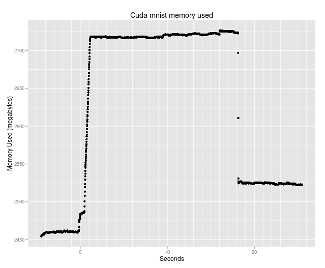

  
### Caffe memory leak test procedure

#### Obtain a chart of memory used by a Caffe mnist run using 100 per second observations. 
  
author: Neil Nelson  
date: 04/26/2016  

Requires PHP and RStudio.  

This procedure is run after the test set-up is completed. [Caffe install procedure used in testing](https://github.com/neilnelson/caffe_memory_test/blob/master/caffe_install.md)  

Copy the following programs from the [caffe_memory_test](https://github.com/neilnelson/caffe_memory_test) page to the caffe-master/test directory created in the just mentioned Caffe install procedure.
```
get_memory_usage.php  
create_mem_csv.php
```

get_memory_usage.php is the __free__ stats collection program. You can do a preliminary run of the Caffe mnist training, shown below, to find out how long it takes. The run takes around 18 seconds here. Do a head and tail of the test/run.log to get the beginning and ending run times. Subtract the beginning from the ending to get run seconds. Add ten seconds so that get_memory_usage.php run will get stats before and after the Caffe run. I used a total of 30 seconds to get about 5 seconds on each side. 
```
php test/get_memory_usage.php *number_of_seconds*
```

About five seconds after starting get_memory_usage.php start the Caffe mnist run. Run these programs in separate terminal windows and while they are running just watch and do not cause any other actions on the computer so that the memory stats being recorded are not confused with other activity. __free__ reports memory used by everything on the computer and we want the memory changes to be dominated by the Caffe run.
```
build/tools/caffe train --solver=test/lenet_solver.prototxt > test/run.log 2>&1
```
The next program collects observation times and memory used stats from the test/get_memory_usage.log created by get_memory_usage.php and writes those to a csv file test/mem_used.csv. In order to match the times between the memory usage log file and the Caffe log file the program assumes that the change time on the Caffe log file is the date for the times collected in that file. This would not be true if the Caffe run spanned midnight.
```
php test/create_mem_csv.php
```
The following commands are done in RStudio.
```
mem_used_log = read.csv("/caffe_path_from_root/caffe-master/test/mem_used.csv")
library(ggplot2)
qplot(mem_used_log$seconds, mem_used_log$mem_used, main = "Caffe mnist memory used", xlab='Seconds', ylab='Total System Memory Used (MB)') +
  theme(panel.grid.major = element_line(colour="white", size=0.5)) +
  theme(panel.grid.minor = element_line(colour="white", size=0.3)) +
  scale_x_continuous(minor_breaks = seq(-5 , 50, 1), breaks = seq(0, 50, 10))
```
Here is my chart.  


We can look at test/mem_used.csv to get an idea of the size of the memory leak for this Caffe mnist run. It looks like the Caffe run starts before the zero mark and we can get a memory used figure close to one second before the zero mark as follows.
```
grep '\-0' test/mem_used.csv | head
```
From the first line get the second number, the one after the comma. This is the system memory used close to one second before the first line time in the Caffe run log (test/run.log). The shelf is flat at this point on my chart.

Get the ending memory usage number as follows.
```
tail test/mem_used.csv
```
On the last line the second number, as above, is the end of the shelf to the right in the picture. That difference here is
```
2522.5896148682-2460.8234863281 = 61.766 megabytes leaked approximately.
```

