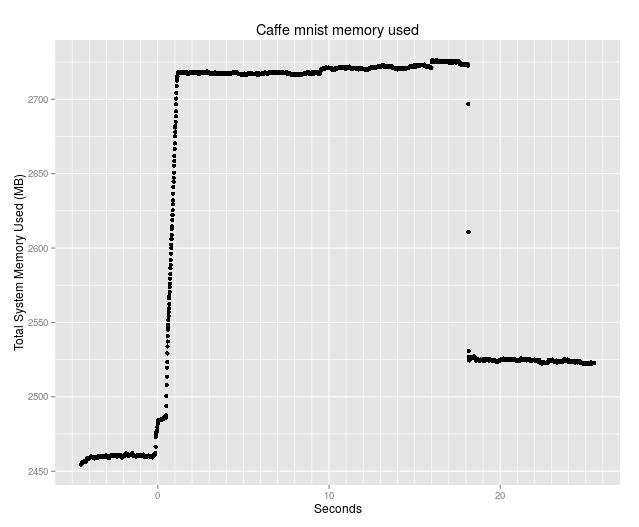

  
### Caffe memory leak test procedure

## Obtain a chart of memory used by a Caffe mnist run using 100 per second observations. 
  
author: Neil Nelson  
date: 04/26/2016  

Requires PHP and RStudio.  

This procedure is run after Caffe is installed. The installation used here is at [Caffe install procedure used in testing](https://github.com/neilnelson/caffe_memory_test/blob/master/caffe_install.md).  

Copy the following programs from this github page to the caffe-master/test directory created in the just mentioned Caffe install procedure.
```
get_memory_usage.php  
create_mem_csv.php
```

get_memory_usage.php is the free stats collection program. You can do a preliminary run of the Caffe mnist training, shown below, to find out how long it takes. Do a head and tail of the test/run.log to get the beginning and ending run times. Subtract the beginning from the ending to get run seconds. Add ten seconds or so so that get_memory_usage.php run will get stats before and after the Caffe run. I used a total of 30 seconds. 
```
php test/get_memory_usage.php *number_of_seconds*
```

At least one second after starting get_memory_usage.php, start the Caffe mnist run.
```
build/tools/caffe train --solver=test/lenet_solver.prototxt >> test/run.log 2>&1
```
The next program collects observation times and memory used stats from test/get_memory_usage.log and writes those to a csv file test/mem_used.csv. In order to match the times between the memory usage file and the Caffe log file, the program assumes that the change time on the Caffe log file is the date for the times collected in that file. This would not be true if the Caffe run spanned midnight.
```
php test/create_mem_csv.php
```
The following commands are done in RStudio.
```
mem_used = read.csv("/caffe_path_from_root/caffe-master/test/mem_used.csv")
library(ggplot2)
qplot(mem_used$seconds, mem_used$mem_used, main = "Cuda mnist memory used", xlab='Seconds', ylab='Memory Used (megabytes)') +
  theme(panel.grid.major = element_line(colour="white", size=0.5)) +
  theme(panel.grid.minor = element_line(colour="white", size=0.3)) +
  scale_x_continuous(minor_breaks = seq(0 , 50, 1), breaks = seq(0, 50, 10))
```
Here is my chart  
Format: 

